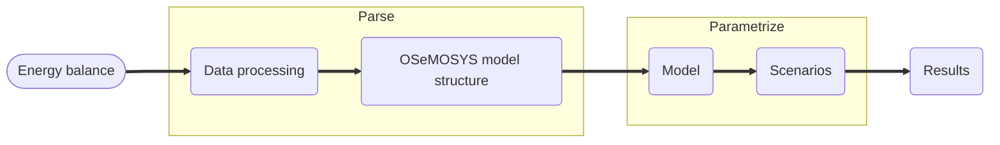

## Modeling and Simulation of Integrated Energy Systems

> The modeling of energy systems allows the creation of scenarios that seek to provide inputs on the most cost-effective transformations to supply energy demand. In general, energy models are developed with the objective of building a long-term sustainable economy, through the synergy of technical aspects of the production processes in the countries where they are developed, the temporal and spatial behavior of energy sources, the demand requirements to be satisfied, the use of optimization techniques, the inclusion of commercial and industrial interests, the formulation of public policies and the study of anthropological aspects [[1]](https://www.open.edu/openlearncreate/course/view.php?id=6817).

---

In order to inform the development of multi-regional energy strategies and support them with capacity building activities this project focus is on modelling system for long-run (decades) integrated assessment and energy strategical planning given different scenarios by implementing the *Open Source energy MOdelling SYStem* (OSeMOSYS) methodology complemented with other open source tool such as `Python` to model the Latin America and the Caribbean *Reference Energy System* (RES).

### Work flow:

### References 

[1] [Energy and Flexibility Modelling: OSeMOSYS & FlexTool](https://www.open.edu/openlearncreate/course/view.php?id=6817)

[2] [Sielac-OLADE](https://sielac.olade.org/)

[3] [OSeMOSYS’ documentation!](https://osemosys.readthedocs.io/en/latest/index.html)

---

Universidad de Costa Rica  (UCR)

Escuela de Ingeniería Eléctrica (EIE)
